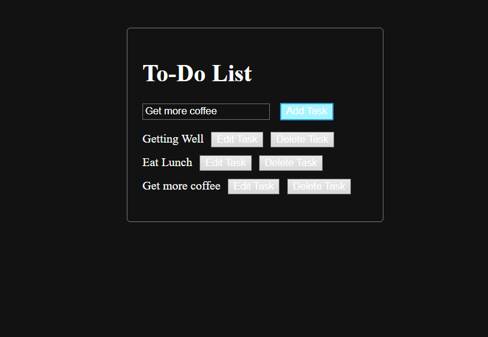

# Hands-On Lab: Manipulating DOM with JavaScript
 another assessment from the IBM full stack software developer from coursera

Using HTMLL, CSS, and JavaScript I created a to-do list webpage as part of a hands-on lab in the introduction to HTML, CSS & JavaScript course.

I used HTML to structure the container I used to collect the information (the task) from an input element. I then used CSS to style the 
 container to make it more attractive. I then wrote JavaScript code to add functionality to the buttons of the to-do list.

# Adding a task

using the Add Task button that invokes the JavaScript function "addTask" whenever the button is clicked to add a task onto the container, you can write your task on the input field and add it to your to-do list when you click the add task button.

# Edit a task

using the edit task button, you can edit on a prompt window. In the screenshots below you can see a  task being edited from "Getting Better" to "Getting Well".

# Remove a task

by clicking on the delete button, you can remove a task along with it's child embedded buttons "Edit Task" and "Delete Task"

